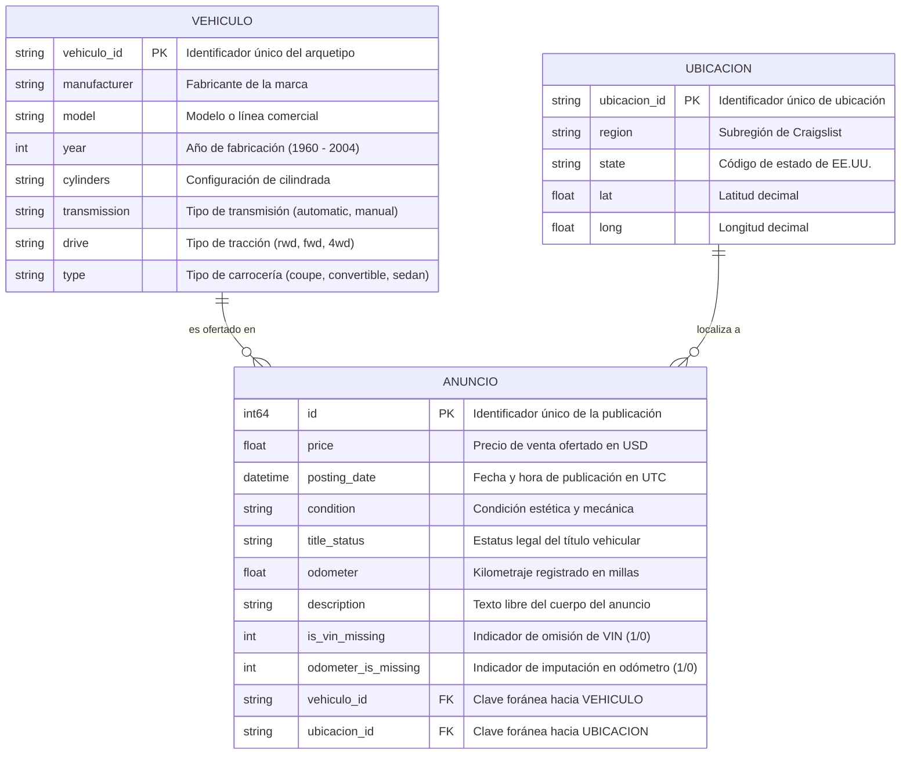

# Modelado Relacional y Diagrama Entidad-Relación

## 1. Identificación y Definición de Entidades

El dataset original plano (`.csv`) puede descomponerse en una estructura relacional de **tercera forma normal (3NF)** compuesta por 3 entidades principales:

1. **`VEHICULO` (Catálogo / Arquetipo de Especificación Automotriz):**
   - Representa las características técnicas y mecánicas fijas de fábrica que definen la versión del automóvil.
   - **Atributos:** `vehiculo_id` (Clave primaria surrogate o hash de especificación), `manufacturer`, `model`, `year`, `cylinders`, `transmission`, `drive`, `type`.
   - **Cardinalidad Observada en Datos Reales:** En el dataset limpio de 5,703 registros existen **3,501 combinaciones únicas** de vehículos. El ratio promedio es de **~1.63 anuncios por cada configuración de vehículo**, alcanzando hasta 30 anuncios para combinaciones populares (ej. *Chevrolet Corvette 2001 Coupe RWD Manual*).

2. **`UBICACION` (Dimensión Espacial y Geográfica):**
   - Representa el punto geográfico y administrativo donde se localiza la venta.
   - **Atributos:** `ubicacion_id` (Clave primaria), `region`, `state`, `lat`, `long`.
   - **Cardinalidad Observada en Datos Reales:** Existen **4,466 combinaciones únicas** de coordenadas y regiones, con concentraciones de hasta 16 anuncios en un mismo nodo geoespacial.

3. **`ANUNCIO` (Entidad Transaccional / Hecho):**
   - Representa el evento de publicación individual en Craigslist en un momento específico en el tiempo.
   - **Atributos:** `id` (Clave primaria provista por Craigslist), `price` (Variable objetivo continua), `posting_date`, `condition`, `title_status`, `odometer`, `description`, `is_vin_missing`, `odometer_is_missing`, `vehiculo_id` (FK), `ubicacion_id` (FK).

---

## 2. Relaciones y Cardinalidades

- **`VEHICULO` (1) a `ANUNCIO` (N):**  
  Un modelo/arquetipo de vehículo específico puede ofertarse en **cero, uno o múltiples anuncios** de Craigslist en diferentes estados de conservación y kilometraje. Cada anuncio corresponde exactamente a **un único tipo de vehículo**.
- **`UBICACION` (1) a `ANUNCIO` (N):**  
  Una ubicación geográfica (nodo región/coordenadas) puede ser sede de **múltiples publicaciones**, pero cada anuncio está radicado en **una única ubicación**.

---

## 3. Diagrama Entidad-Relación (Mermaid)

